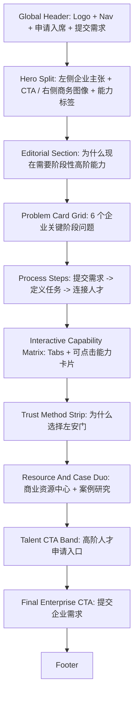

# 01 首页

> 状态：已定稿，供 coding agent 实现首页高保真原型使用。
> 当前任务范围：只实现首页，不改其他页面 md，不创建后台、登录、匹配引擎或真实表单后端。

## 1. Coding Agent 角色

你是这个项目的资深前端工程协作者，负责把 `docs/01-home.md` 转化为首页高保真原型。

你的目标不是自由发挥一个新 landing page，而是严格根据本文件、`docs/DESIGN.md` 和 `PROJECT_PROGRESS.md` 实现左安门官网首页。

实现前必须读取：

- `PROJECT_PROGRESS.md`
- `docs/DESIGN.md`
- `docs/01-home.md`

如果当前环境有以下 skill，可以调用，但不能覆盖 `docs/DESIGN.md`：

- `frontend-design`：用于提升页面视觉质量、信息层级和高保真还原。
- `impeccable`：用于审视和打磨前端界面设计感、视觉层级、排版节奏、组件细节和交互质量。它是设计质量参考，不是阻塞性流程；不要因为缺少 PRODUCT.md 或 shape brief 而停止首页实现。
- `web-design-guidelines`：用于检查可用性、响应式和企业级页面结构。
- `webapp-testing` 或 browser 工具：用于本地预览、截图和交互验证。

必须遵守：

- `docs/DESIGN.md` 是视觉系统唯一来源。
- 首页主路径面向企业端，人才端作为次入口。
- 不嵌入首屏表单，首页 CTA 点击跳转到对应页面。
- 不编造未确认数字、客户 logo、案例名称或服务承诺。
- 不使用东方装饰、黑金风、渐变 SaaS 风、玻璃拟态、圆角 pill-heavy UI。
- 不把页面做成炫技 demo，要做企业级、图文结合、可信、清晰的服务首页。

## 1.1 参考文件使用方式

Coding agent 不只是“读取文件”，而是要按下面的方式使用文件：

| 文件 / 资源 | 使用方式 |
|---|---|
| `docs/DESIGN.md` | 视觉系统唯一来源。颜色、字体、间距、按钮、卡片、表单、导航、footer 都必须服从它。 |
| `PROJECT_PROGRESS.md` | 理解项目阶段、业务边界、导航命名、不要编造数字和不要做后台系统等全局约束。 |
| `PARALLEL_PAGE_WORKFLOW.md` | 理解 harness、工作区边界、并行开发规则和本页开发范围。 |
| `docs/01-home.md` | 首页内容、模块顺序、CTA、交互和高保真布局的页面级来源。 |
| `C:\Users\Leo\Downloads\btg-homepage-high-fidelity.html` | 只作为高保真参考。学习其首页节奏、图文比例、能力矩阵、CTA 编排和可读性，不复制品牌、英文文案、logo 或配色。 |
| `fronted/home/` | 首页主体实现位置。页面级 HTML、CSS、JS、首页专属图片占位和首页专属交互都放这里。 |
| `fronted/shared/` | 全站通用 Header、Footer、基础按钮、基础布局组件可以放这里。只有通用组件才放 shared。不要把首页专属 section 放进 shared。 |

使用 skill 时的方向：

- 用 `frontend-design` 和 `impeccable` 判断页面是否像真实企业官网，而不是普通文档页。
- 用它们检查视觉节奏、图文比例、tabs 矩阵、CTA 层级、hover/focus 状态。
- 不要照搬 skill 内部风格规则覆盖 IBM/Carbon 方向。
- 不要因为 skill 的完整流程要求而中断当前 harness 开发。

## 1.2 技术与 Harness 约束

首页实现语言以 HTML + CSS + JavaScript 为主。

实现要求：

- 首页页面文件夹：`fronted/home/`
- 路由建议：`/`
- Header、Footer 是全站通用界面壳层，应该放在 `fronted/shared/`。
- 首页主体 section 必须放在 `fronted/home/`。
- 如果项目还没有 shared Header/Footer，本次可以在 `fronted/shared/` 新建最小可复用 Header/Footer。
- 如果项目已有 shared Header/Footer，优先复用，不要重复造一份。
- 不改 `fronted/services/`、`fronted/resources/`、`fronted/join/`、`fronted/find-talent/`。
- 不改其他页面 md。
- 不接入真实后端，不创建登录、后台、支付、匹配引擎。
- JavaScript 只用于轻量交互：
  - Header 导航跳转。
  - CTA 跳转。
  - 能力矩阵 tabs 切换。
  - 移动端导航展开/收起。
  - 卡片 hover/focus 状态。

开发需遵循项目已有 harness 规范：

- 先读 `PROJECT_PROGRESS.md`、`docs/DESIGN.md`、当前页面 md。
- 只开发当前页面。
- 验证本地页面能打开、跳转能触发、响应式没有明显溢出。
- 不保留临时截图、测试资产或无关文件。

## 2. 页面定位

首页是左安门网站 MVP 的品牌总入口，也承担首版“关于左安”和“为什么选择左安”的功能。

用户进入首页后 5 秒内应该理解：

- 左安门服务企业的关键阶段问题。
- 左安门连接的是能进入问题现场的高阶独立人才。
- 企业可以通过“提交企业需求”进入需求说明流程。

首页核心表达：

> 为关键阶段的企业，连接能进入问题现场的高阶人才。

首页不应该表达成：

- 普通招聘平台
- 自由职业者平台
- 传统咨询公司
- AI SaaS 平台
- 已经成熟运营的大型 marketplace

更准确的表达是：

> 左安门站在企业问题和高阶人才之间，先帮助企业定义问题，再连接适合的独立高管、顾问或专家团队。

## 3. 用户路径

### 企业主路径

企业用户是首页首屏和整页的主要服务对象。

路径：

1. 看见企业关键阶段问题。
2. 理解左安门不是单纯招聘，也不是传统咨询。
3. 浏览典型问题和服务能力。
4. 点击 `提交企业需求`。
5. 跳转到 `/find-talent`。

### 高阶人才路径

人才用户不是首页主叙事，但需要有稳定入口。

路径：

1. 从 Header 或首页靠后模块看到 `申请入席`。
2. 理解左安门欢迎有真实业务经验、专业判断力和项目交付能力的高阶独立人才。
3. 点击 `申请入席`。
4. 跳转到 `/join`。

### 内容读者路径

内容读者通过资源模块理解左安门的问题判断能力。

路径：

1. 看到资源/洞察 Banner。
2. 点击 `阅读资源`。
3. 跳转到 `/resources`。

## 4. 页面信息架构

页面采用 BTG-style 企业服务首页结构：首屏简洁，后续内容完整，图文结合，CTA 明确，表单后置。

高保真优先级：

1. Hero 首屏必须像真实官网：图文分栏、明确主张、清晰 CTA。
2. Interactive Capability Matrix 必须有设计感和轻交互：tabs 切换、卡片跳转、hover/focus 状态。
3. Editorial Section 和 Resource And Case Duo 必须提供图文节奏，避免全页都是卡片。
4. Footer 和 Header 必须像完整网站壳层，而不是临时占位。
5. 其他说明模块可以简洁，不要把每个 section 都做得同样重。

容易干扰高保真的点，开发时要主动避免：

- 不要把所有内容都做成同款卡片网格。Problem Grid、Capability Matrix、Trust Method Strip 必须有不同视觉结构。
- 不要把文档里的所有解释都塞进页面。每个模块只保留标题、短正文和一个明确动作。
- 不要把 `impeccable` 当成必须跑完整流程的硬门槛。它用于设计审视，不用于阻塞实现。
- 不要把首页做成表单页。首屏只放按钮，需求表单入口跳 `/find-talent`。
- 不要让 BTG 参考覆盖左安门视觉系统。BTG 参考的是信息架构和模块设计，不是颜色、字体或文案。
- 不要过度使用 placeholder。没有真实图片时，也要做成高质量 Image Panel 占位，而不是空白灰框。
- 不要平均分配版面权重。Hero、Capability Matrix、Resource And Case Duo、Final CTA 是视觉重点。

模块顺序：

1. Global Header
2. Hero Split Section
3. Editorial Section：为什么现在需要阶段性高阶能力
4. Problem Card Grid：企业常见关键阶段问题
5. Process Steps：左安门如何工作
6. Interactive Capability Matrix：我们做什么
7. Trust Method Strip：为什么选择左安门
8. Resource And Case Duo：商业资源中心 / 案例研究
9. Talent CTA Band：人才侧入口
10. Final Enterprise CTA
11. Footer

## 5. 高保真布局说明

### 5.1 Global Header Component

归属：

- Header 是全站通用组件，放在 `fronted/shared/`。
- 首页在 `fronted/home/` 中引用 shared Header。
- 如果 shared Header 尚不存在，本次可以创建最小版本，但不要加入首页专属逻辑。

布局：

- 左侧：Logo 文本 `左安门`
- 中间：主导航
- 右侧：两个 CTA 按钮

导航：

- 首页 -> `/`
- 我们做什么 -> `/services`
- 资源 -> `/resources`
- 加入左安 -> `/join`
- 寻找人才 -> `/find-talent`

右侧 CTA：

- `申请入席`：Secondary Button，跳转 `/join`
- `提交需求`：Primary Button，跳转 `/find-talent`

设计：

- 使用 `docs/DESIGN.md` 的 IBM/Carbon 风格。
- 白底、细底边框、方形按钮。
- 不使用大圆角、阴影或渐变。
- Desktop 使用横向导航。
- Mobile 使用菜单按钮展开导航，JavaScript 只负责展开/收起与跳转。

### 5.2 Hero Split Section Component

目标：企业用户一眼知道左安门解决什么问题，并点击提交企业需求。

布局：

- 背景：白色。
- Desktop：左文案 55%，右视觉 45%。
- Mobile：文案在上，视觉在下。
- 组件：Eyebrow + H1 + Lead Text + Button Group + Image Panel。

左侧内容：

- Eyebrow：`企业关键阶段的高阶人才支持`
- H1：`为企业关键阶段，连接能判断问题并推动落地的高阶人才`
- Lead：
  `当增长、组织、AI 转型或临时负责人缺口影响业务推进时，左安门帮助企业把问题定义清楚，并连接合适的独立高管、顾问或专家团队。`

按钮：

- Primary Button：`提交企业需求` -> `/find-talent`
- Secondary/Text Button：`查看我们做什么` -> `/services`

右侧视觉：

- 使用商务协作照片或高管讨论照片。
- 可使用 Image Panel Component。
- 图片上可叠加 2-3 个小型 Info Tag：
  - `临时高管`
  - `AI 转型顾问`
  - `项目型专家团队`
- 不使用表单、数据仪表盘、抽象渐变图或东方装饰图。

### 5.3 Editorial Section Component

目标：解释为什么企业需要阶段性高阶能力，而不只是招聘更多人。

布局：

- 图文双栏。
- 左侧：商务图像或企业工作现场图。
- 右侧：Section Heading + Body + Highlight List。
- 下一段可反向图文排列，形成页面节奏。

标题：

`企业缺的往往不是更多人，而是能接手关键问题的人`

正文：

`在增长瓶颈、组织变化、AI 转型和关键项目推进中，企业需要的常常不是新增一个长期岗位，而是一段时间内可以进入现场、判断问题、推动落地的高阶能力。`

Highlight List：

- `不一定需要全职雇佣`
- `不一定适合大咨询项目`
- `需要的是按阶段配置的高阶能力`

### 5.4 Problem Card Grid Component

目标：让企业用户对号入座，确认“这说的是我”。

布局：

- Desktop：3 列 x 2 行。
- Tablet：2 列。
- Mobile：1 列。
- 组件：Line Number + Card Title + 2-line Description。
- 这个模块是问题索引，不放每张卡的 CTA，避免动作过密。

卡片内容：

1. `增长停滞`
   - 描述：`需要重新判断市场、渠道、销售组织或增长模型。`
2. `AI 转型`
   - 描述：`判断哪些业务环节值得先改，而不是先买工具。`
3. `组织升级`
   - 描述：`进入新阶段后，补齐管理机制和关键岗位能力。`
4. `临时负责人缺口`
   - 描述：`CFO、COO、CMO、HRVP 等关键角色暂时缺位，需要过渡方案。`
5. `新业务探索`
   - 描述：`验证方向、搭建路径、推进试点。`
6. `项目攻坚`
   - 描述：`关键项目缺少负责人、PMO 或跨职能专家。`

### 5.5 Process Steps Component

目标：说明左安门不是只介绍人，而是先定义问题，再连接人才。

布局：

- Desktop：横向 3 步，带编号和细箭头。
- Mobile：纵向步骤。
- 组件：Step Number + Title + Text。

步骤：

1. `提交需求`
   - `企业用简短信息说明当前问题、业务阶段和希望获得的支持。`
2. `定义任务`
   - `左安门先帮助澄清问题边界、角色类型、合作方式和预期结果。`
3. `连接人才`
   - `根据任务需要，推荐独立高管、顾问、专家或小型项目团队。`

注意：

- 不写 `1小时响应`、`48小时匹配`、`AI 自动匹配` 等未确认承诺。
- 可以表达“快速进入下一步”，但不要写成确定服务 SLA。

### 5.6 Interactive Capability Matrix Component

目标：以更有设计感的方式预览左安门的服务能力。这个模块参考 BTG 首页的能力矩阵：左侧是分类 tabs，右侧是可点击能力卡片。它不是静态表格，而是用 JavaScript 支持简单高效的 tab 切换和卡片跳转。

布局：

- Section Heading：`我们做什么`
- Lead Text：`左安门围绕企业关键阶段的问题，组织高阶独立人才、顾问和专家团队，提供按需、分时和项目制支持。`
- Desktop：左侧 25% vertical tabs，右侧 75% matrix grid。
- Tablet：顶部 horizontal tabs，下面 2 列 matrix grid。
- Mobile：tabs 横向滚动，卡片 1 列。
- 组件：Vertical Tabs + Matrix Grid + Clickable Capability Card + Text Link。

Tabs：

1. `服务能力`
2. `企业场景`
3. `角色类型`

Tab 1：服务能力

- `按需人才`
  - 描述：`为阶段性任务配置外部高阶能力，不必先创建长期岗位。`
  - Link：`/services`
- `临时高管`
  - 描述：`CFO、COO、CMO、HR、CTO 等关键角色的阶段性支持。`
  - Link：`/services`
- `项目型专家团队`
  - 描述：`围绕增长、组织、转型、新业务等任务组建小型专家组。`
  - Link：`/services`
- `专家诊断与访谈`
  - 描述：`在决策前快速获得行业、职能或管理经验判断。`
  - Link：`/services`

Tab 2：企业场景

- `增长瓶颈`
  - 描述：`重新判断市场、渠道、销售组织或增长模型。`
  - Link：`/services`
- `AI 转型`
  - 描述：`找到值得优先改造的业务环节，并形成可执行试点。`
  - Link：`/services`
- `组织升级`
  - 描述：`支持组织结构、关键岗位、管理机制和团队能力升级。`
  - Link：`/services`
- `项目攻坚`
  - 描述：`为时间敏感的关键项目补充负责人、PMO 或跨职能专家。`
  - Link：`/services`

Tab 3：角色类型

- `临时高管`
  - 描述：`在过渡期、增长期或变革期进入企业承担阶段性管理职责。`
  - Link：`/services`
- `独立顾问`
  - 描述：`围绕战略、增长、组织、运营等问题提供专业判断和方案。`
  - Link：`/services`
- `项目负责人`
  - 描述：`把目标拆成任务、里程碑和责任人，推动项目落地。`
  - Link：`/services`
- `行业专家`
  - 描述：`提供行业判断、经验校准和关键决策前的信息输入。`
  - Link：`/services`

交互：

- 点击左侧 tab，右侧卡片内容切换。
- 当前 tab 使用 `primary` 蓝色文字或左侧 1px active border，不要使用粗色条。
- 卡片整体可点击，也保留 `了解更多` text link。
- 卡片 hover：边框变为 `primary` 或背景轻微变为 `surface-muted`。
- 键盘 focus 状态必须清晰。

设计：

- 这个模块要比普通 card grid 更有首页设计感。
- 使用大面积留白、细网格线、明确分区。
- 避免一堆同质化小卡片。
- 不使用超过 1px 的左侧粗色条，因为 `impeccable` 规则禁止 side-stripe border 作为装饰。

### 5.7 Trust Method Strip Component

目标：承担首版“为什么选择左安门”的内容，但避免夸大平台成熟度。

布局：

- 左侧标题，右侧纵向 4 条方法论条目。
- 使用编号 + 标题 + 短正文。
- 不再使用 2 x 2 卡片，避免和 Problem Grid、Capability Matrix 重复。

内容：

1. `先定义问题`
   - `不直接推荐人，先把企业问题、任务边界和预期结果说清楚。`
2. `再判断角色`
   - `判断需要的是临时高管、独立顾问、专家诊断，还是项目型团队。`
3. `连接合适人才`
   - `重点连接有管理经验、项目经验或专业判断力的高阶独立人才。`
4. `关注落地场景`
   - `关注合作边界、过程推进和基本合规，而不是只完成介绍。`

不要使用：

- `全球首创`
- `500家企业`
- `99% fill rate`
- `NPS`
- `末位淘汰`
- `保险赔付`
- 未确认客户 logo

### 5.8 Resource And Case Duo Component

目标：用资源和案例双入口证明左安门的问题判断能力，并与 Footer 的资源分类一致。

布局：

- 左右两块并列，移动端堆叠。
- 左侧：商业资源中心。
- 右侧：案例研究。
- 背景：`surface-muted` 或白色带细边框。

左侧标题：

`企业如何使用阶段性高阶人才？`

左侧正文：

`什么时候适合找独立高管、顾问或专家团队，什么时候更适合全职招聘或传统咨询。`

左侧 CTA：

- `进入商业资源中心` -> `/resources`

右侧标题：

`从真实经营问题理解左安门的工作方式`

右侧正文：

`通过匿名场景了解企业如何定义问题、选择角色并推进关键任务。`

右侧 CTA：

- `查看案例研究` -> `/resources`

### 5.9 Talent CTA Band Component

目标：给高阶人才清晰入口，但不抢企业主路径。

布局：

- 左侧文字，右侧按钮。
- 可使用浅灰背景或深色反相 CTA。

标题：

`成为左安门的独立人才`

正文：

`如果你有真实业务经验、专业判断力和项目交付能力，可以申请加入左安门的人才网络。`

CTA：

- `加入左安` -> `/join`

### 5.10 Final Enterprise CTA Component

目标：页面结束时再次推动企业提交需求。

布局：

- 居中标题 + 一段话 + 一个主按钮。
- 可使用 `inverse-surface` 深色背景，或白色大留白。

标题：

`准备描述你的业务问题？`

正文：

`告诉我们你正在面对的阶段性挑战，左安门会帮助你判断需要什么样的高阶能力支持。`

CTA：

- `提交企业需求` -> `/find-talent`

### 5.11 Footer Component

归属：

- Footer 是全站通用组件，放在 `fronted/shared/`。
- 首页在 `fronted/home/` 中引用 shared Footer。
- 如果 shared Footer 尚不存在，本次可以创建最小版本，后续其他页面复用。

目标：

- 让首页像完整官网，而不是单页 demo。
- 提供清晰的关于左安、服务、资源、人才入口和联系入口。

布局：

- Desktop：5 个同层级列，依次为 `关于左安`、`我们做什么`、`资源`、`加入左安`、`联系我们`；联系我们不另起一行。
- Tablet：2 列。
- Mobile：单列纵向排列。
- 背景：优先使用 `inverse-surface` 深色，文字使用 `inverse-text` 和较弱层级的灰色；也可使用白底细边框版本，但必须和 `docs/DESIGN.md` 一致。
- Footer 需要区分关于左安、我们做什么、资源、加入左安，不要把人才和资源混在同一列。
- Footer 内容应由 `fronted/shared/shared.js` 中的配置数组渲染，便于后续所有页面共用同一套导航和文案。

Column 1：关于左安

- `为什么选择左安` -> `/#why-zuoan`
- `左安如何工作` -> `/#how-it-works`

Column 2：我们做什么

- `按需人才` -> `/services`
- `临时高管` -> `/services`

Column 3：资源

- `商业资源中心` -> `/resources`
- `案例研究` -> `/resources`

Column 4：加入左安

- `成为独立人才` -> `/join`
- `人才资源` -> `/join`

说明：

- `加入左安` 和 `申请入席` 是同一个意思，不要在 Footer 中重复并列。
- Header 里可以继续使用 `申请入席` 作为按钮文案；Footer 里用 `加入左安` 作为人才入口主链接。

Column 5：联系我们

- 标题：`联系我们`
- 邮箱链接：`contact@zuoanmen.com`
- 右侧并列放 `关注我们` + 方形二维码占位框，二维码框文字为 `公众号二维码`
- 邮箱和二维码均为原型占位，正式上线前需要确认真实邮箱和二维码图片。
- 这个板块在 Desktop 与前四个栏目同一行，作为第五列；联系信息与公众号二维码在第五列内部横向并列，不要做成单独横条或独立卡片。

Bottom Bar：

- `© 2026 左安门`
- `隐私政策`
- `服务条款`

注意：

- 如果隐私政策和服务条款页面尚不存在，可以先作为文本占位或禁用链接，不要新建页面。
- Footer 链接 hover 使用 `primary` 或 inverse link 状态。
- 不要在 footer 中放未确认地址、公司实体、备案号或电话。
- 邮箱和二维码目前只作为原型占位，正式上线前必须替换为已确认信息。

## 6. 点击跳转

- `提交需求` / `提交企业需求` -> `/find-talent`
- `申请入席` -> `/join`
- `查看我们做什么` / `查看全部服务` -> `/services`
- `阅读资源` -> `/resources`
- 首页 Logo -> `/`

首页不嵌入完整表单。需求表单放在 `/find-talent`。人才申请表单放在 `/join`。

## 7. 视觉与组件要求

整体风格：

- IBM/Carbon-style 企业服务首页。
- 白底 + 浅灰分区。
- IBM Blue 只用于主 CTA、链接、focus state。
- Charcoal 正文。
- 方形按钮、方形卡片、细边框。
- 图文结合，不做纯文字门户。
- 信息完整但层级清楚。

组件优先级：

- Button
- Text Link
- Shared Header
- Shared Footer
- Image Panel
- Info Tag
- Feature Card
- Problem Card
- Step Card
- Vertical Tabs
- Matrix Grid
- Clickable Capability Card
- Resource And Case Duo
- CTA Band

不要使用：

- 首屏表单
- 大号数据仪表盘
- 静态不可交互的能力表格
- 黑金风
- 东方符号装饰
- 抽象渐变 hero
- 过度圆角胶囊按钮
- 未确认客户 logo 或数字

高保真要求：

- 页面要像真实企业官网首页，而不是文档转 HTML。
- 每个 section 都要有明确的信息层级：eyebrow、heading、body、action。
- 至少使用 2 个图文结合 section，避免全页文字卡片堆叠。
- 能力矩阵必须有 tabs 切换，让信息分层放置。
- 卡片、tab、button、link 都要有 hover、focus、active 状态。
- 移动端要保持同样清晰的阅读顺序，不靠缩小桌面版硬塞。

## 8. 文案语气

语言要平实、专业、具体、易读懂。

保留的表达方向：

- 企业不是简单缺人，而是缺能判断问题、进入现场、推动结果的高阶能力。
- 左安门站在企业问题和高阶人才之间。
- 左安门先定义问题，再匹配人。
- 合作方式可以是分时、项目制、临时高管、专家团队。
- AI 可以作为能力增强背景，但不要成为首页主角。

避免的表达：

- `全球首创`
- `AI原生高端人才基础设施`
- `企业版高端人才操作系统`
- `一将千军`
- `500家企业`
- `48小时`
- `NPS / 末位淘汰 / 保险赔付`
- 过细的税务、合同、SOW、合规条款

这些内容可以未来进入 FAQ、服务详情页或企业用户问题页，不放在首页首版。

## 9. 线框图

## 10. 完成标准

Coding agent 完成首页后应检查：

- 首屏是否明确面向企业端。
- 首屏是否没有嵌入表单。
- CTA 是否全部跳转到正确路径。
- 页面是否图文结合，而不是纯文字堆叠。
- 是否使用 HTML + CSS + JavaScript 完成轻量交互和跳转。
- 是否遵循 harness 文件夹边界：页面主体写 `fronted/home/`，全站 Header/Footer 写 `fronted/shared/`。
- 是否没有把首页专属模块放进 `fronted/shared/`。
- 是否没有改 `fronted/services/`、`fronted/resources/`、`fronted/join/`、`fronted/find-talent/`。
- 能力矩阵 tabs 是否可以点击切换，卡片是否可以点击跳转。
- 页面是否有足够设计感：图文节奏、tabs 矩阵、资源 Banner、CTA Band 都应像真实官网模块。
- Header 和 Footer 是否已经具备完整官网常见排列，而不是临时占位文本。
- 是否严格遵守 `docs/DESIGN.md`。
- 是否没有编造数字、logo、案例或服务承诺。
- 是否没有修改其他页面 md。
- 是否可作为高保真首页原型交付。
