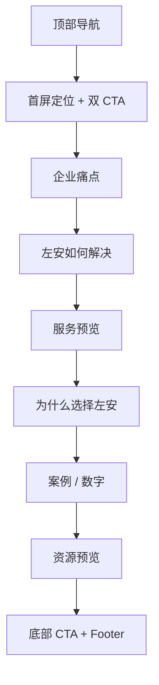

# 01 首页

> 状态：骨架待讨论。首页负责品牌总入口，合并“关于左安”和“为什么选择左安”的首版功能。

## 1. 页面目标

- 待讨论：用户进入首页后 5 秒内应理解什么
- 待讨论：首页的主要转化动作

## 2. 用户路径

- 企业主路径：
- 高阶人才路径：
- 内容读者路径：

## 3. 页面模块

1. 首屏定位
2. 双入口 CTA
3. 企业痛点
4. 左安如何解决
5. 三类服务预览
6. 为什么选择左安
7. 经验数字 / 匿名案例
8. 资源洞察预览
9. 底部 CTA

## 4. 线框图

## 5. 点击跳转

- 提交需求：
- 申请入席：
- 查看服务：
- 查看资源：

## 6. 待补内容

- 首屏标题
- 副标题
- 痛点清单
- 信任数字
- 匿名案例
