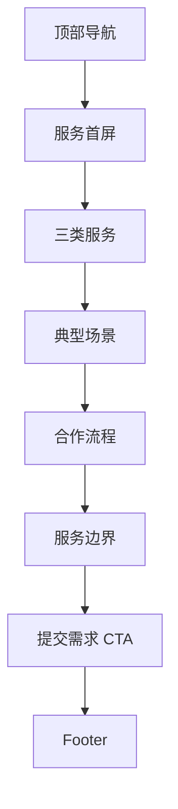

# 02 我们做什么

> 状态：骨架待讨论。服务页负责讲清楚左安可以承接什么，以及不承诺什么。

## 1. 页面目标

- 待讨论：服务边界
- 待讨论：第一版是否只讲三类服务

## 2. 用户路径

- 企业主理解服务：
- 企业主提交需求：
- 人才理解可参与项目：

## 3. 页面模块

1. 服务总述
2. 按需人才
3. 临时高管
4. 项目制专家团队
5. AI 增长与战略转型
6. 典型场景
7. 合作流程
8. 服务边界
9. CTA

## 4. 线框图

## 5. 点击跳转

- 按需人才：
- 临时高管：
- 项目团队：
- 提交需求：

## 6. 待补内容

- 三类服务定义
- 典型场景清单
- 合作流程文字
- 不能承诺的服务
