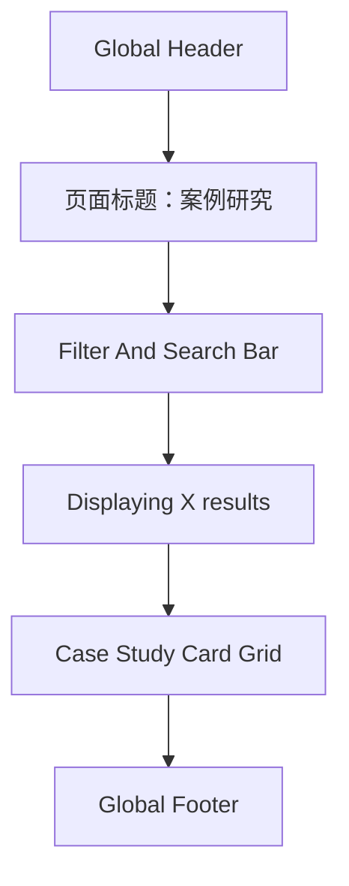

# 03 资源

> 状态：已定稿，供 coding agent 实现资源页高保真原型使用。
> 当前任务范围：只实现资源页，不改其他页面 md，不创建后台、登录、匹配引擎、真实表单后端或内容管理系统。

## 1. Coding Agent 角色

你现在是这个项目的资深前端工程协作者，负责把资源页实现成一个清晰、克制、可筛选的案例研究列表页。

实现前必须读取：

- `PROJECT_PROGRESS.md`
- `docs/DESIGN.md`
- `docs/03-resources.md`

可用设计参考：

- `frontend-design`：用于提升页面视觉质量、信息层级和高保真还原。
- `impeccable`：用于审视和打磨前端界面设计感、视觉层级、排版节奏、组件细节和交互质量。它是设计质量参考，不是阻塞性流程。
- `web-design-guidelines`：用于检查可用性、响应式和企业级页面结构。
- `webapp-testing` 或 browser 工具：用于本地预览、截图和交互验证。

硬性规则：

- `docs/DESIGN.md` 是视觉系统唯一来源。
- 资源页首版只做案例研究列表，不做资源中心 landing page。
- 页面主体不放独立 CTA，不做底部转化 CTA。
- 不放闭门会、课程 / Program、公众号文章入口。
- 不放未经授权的客户 logo、真实客户名或未确认数字。
- 不使用东方装饰、黑金风、渐变 SaaS 风、玻璃拟态、圆角 pill-heavy UI。
- 不让 BTG 参考覆盖左安门视觉系统。BTG 只作为案例列表信息架构参考，不作为颜色、字体或品牌风格参考。

## 1.1 参考文件使用方式

参考 `https://resources.businesstalentgroup.com/btg-case-studies` 的 Case Studies 模块编排：

- 页面标题简单直接。
- 标题下方是筛选器和搜索框。
- 主体是低信息密度案例卡片网格。
- 每张卡片包含图片、标题、短摘要和 `Read` 入口。

不要照搬：

- BTG 的品牌色、字体、导航样式。
- `All Project Types` 筛选器。
- 分享按钮、资源导航、Hub 侧栏或大量资源分类。
- 大量真实案例数量、客户描述或未授权图片。

## 1.2 技术、路径与 Harness 约束

- 资源页页面文件夹：`fronted/resources/`
- 路由建议：`/resources`
- 本页开发写入范围只允许在 `fronted/resources/` 内。
- 不改 `fronted/resources/` 工作区外的任何文件或文件夹。
- 不改 `fronted/shared/`、`fronted/home/`、`fronted/services/`、`fronted/join/`、`fronted/find-talent/`。
- Header、Footer 的样式和结构必须参考 `fronted/shared/`，保持全站统一，但不要修改 `fronted/shared/` 内文件。
- 不改其他页面 md。
- 技术栈使用 HTML + CSS。
- 交互使用原生 JavaScript 实现。
- 不接入真实后端，不创建登录、后台、支付、匹配引擎或 CMS。
- JavaScript 只用于轻量交互：
  - 行业筛选。
  - 功能筛选。
  - 搜索输入。
  - Reset。
  - 案例卡片 hover/focus。
  - 可选的前端详情展开或链接占位。
- 筛选和搜索可以使用前端静态数据模拟，数据可以直接写在资源页自己的 JavaScript 中。
- 先读 `PROJECT_PROGRESS.md`、`docs/DESIGN.md`、当前页面 md。
- 只开发当前页面，且只在 `fronted/resources/` 内完成。
- 验证本地页面能打开，筛选和搜索能触发，响应式没有明显溢出。
- 不保留临时截图、测试资产或无关文件。

## 2. 页面定位

资源页首版定位为：案例研究列表页。

它不承担完整资源中心、内容媒体、活动报名或课程推广职责。它只需要让访问者快速理解：

- 这里是左安门案例研究入口。
- 可以通过行业和功能筛选案例。
- 可以通过搜索查找关键词。
- 案例卡片目前可以使用简短占位内容，后续再替换为左安门确认可公开的匿名案例。

页面主标题：

> 案例研究

不要使用：

- `案例研究与商业问题拆解`
- `商业资源中心`
- `资源中心`
- `洞察与活动`

## 3. 用户路径

### 企业读者路径

1. 从 Header 点击 `资源`。
2. 进入 `/resources`。
3. 看到页面标题 `案例研究`。
4. 使用行业筛选、功能筛选或 Search 查找相关案例。
5. 浏览案例卡片。
6. 点击 `Read` 查看案例详情占位或前端详情状态。

### 高阶人才路径

1. 从 Header 点击 `资源`。
2. 浏览案例研究，理解左安门关注的企业问题类型。
3. 使用行业或功能筛选查看自己熟悉领域的案例。
4. 如需申请入席，使用全站 Header 或 Footer 的既有入口，不在页面主体额外新增 CTA。

### 内容维护路径

1. 首版使用 6-12 条静态案例占位。
2. 后续逐步替换为左安门确认过的匿名案例。
3. 每条案例保持低信息密度，避免把完整案例报告塞进卡片。

## 4. 页面信息架构

资源页必须保持克制，整体像一个企业级 Case Studies 索引页，而不是解释型 landing page。

设计重点：

1. 标题区域极简，只保留 `案例研究`。
2. 筛选区必须清楚，包括行业筛选、功能筛选、Search、Reset。
3. 案例卡片低信息密度，优先可扫读。
4. 不放页面主体 CTA，不做转化区。
5. Header 和 Footer 继续作为全站壳层存在。

页面模块顺序：

1. Global Header
2. Case Studies Title
3. Filter And Search Bar
4. Results Count
5. Case Study Card Grid
6. Global Footer

## 5. 页面模块说明

### 5.1 Global Header

Header 必须与全站 Header 保持一致。

实现方式：

- 参考 `fronted/shared/` 中已有 Header 的结构、间距、字体、颜色和交互状态。
- 如果资源页需要自己的静态 HTML 片段，应在 `fronted/resources/` 内复刻同样视觉效果。
- 不要修改 `fronted/shared/`。
- 不要新建第二套视觉风格不同的 Header。

Header 导航沿用项目统一结构：

- 首页
- 我们做什么
- 资源
- 加入左安
- 寻找人才
- 提交需求

当前页中 `资源` 应显示 active 状态。

注意：

- Header 的全站 `提交需求` 入口可以保留。
- 页面主体不再新增独立 CTA。

### 5.2 Case Studies Title

标题区保持极简。

页面可见内容：

- 主标题：`案例研究`

不要添加大段副标题、说明文案、双 CTA、资源分类入口或 hero 图文分栏。

视觉要求：

- 使用 `docs/DESIGN.md` 的 IBM/Carbon 风格。
- 白色或浅灰背景。
- 左对齐。
- 标题下方直接进入筛选区。
- 不使用大面积装饰图、渐变、插画或营销型 hero。

### 5.3 Filter And Search Bar

筛选区参考 BTG Case Studies 的布局，但只保留两个筛选器和一个搜索框。

字段：

- `All Industries`
- `All Functions`
- `Search`
- `Reset`

不要添加：

- `All Project Types`
- Resource Types
- Blog / Industries / Capabilities / Big Ideas 导航条
- 分享按钮

桌面排布：

```text
Filter:
[ All Industries v ] [ All Functions v ]                 [ Search                    icon ]
Reset
Displaying 12 results
```

移动端排布：

```text
Filter:
[ All Industries v ]
[ All Functions v ]
[ Search                    icon ]
Reset
Displaying 12 results
```

交互要求：

- 行业筛选、功能筛选和搜索可以组合过滤。
- `Reset` 清空两个筛选器和 Search。
- `Displaying X results` 根据筛选结果更新。
- 无结果时显示简短 empty state：`暂无匹配案例，请调整筛选或搜索关键词。`

### 5.4 Case Study Card Grid

主体是案例卡片网格，低信息密度，参考 BTG 的案例卡片节奏。

桌面：

- 3 列或 4 列均可，优先 3 列以保证标题和摘要可读。

平板：

- 2 列。

移动：

- 1 列。

卡片字段：

- 图片或高质量占位图块。
- 案例标题。
- 2 行以内短摘要。
- `Read` 入口。

不要在卡片中展示：

- 企业类型。
- 为什么内部解决不了。
- 需要什么样的人。
- Zuoan 如何介入。
- 可能变化。
- 复杂标签堆叠。
- 大段案例详情。

卡片视觉：

- 使用薄边框、白色底或浅灰底。
- 图片区域保持统一比例。
- 标题和摘要左对齐。
- `Read` 使用 link 或轻按钮样式。
- hover/focus 可以改变边框色或链接色，不使用重阴影。

### 5.5 Global Footer

Footer 必须与全站 Footer 保持一致。

实现方式：

- 参考 `fronted/shared/` 中已有 Footer 的结构、间距、字体、颜色和链接状态。
- 如果资源页需要自己的静态 HTML 片段，应在 `fronted/resources/` 内复刻同样视觉效果。
- 不要修改 `fronted/shared/`。
- 不要新建第二套视觉风格不同的 Footer。

资源页主体不新增底部 CTA。Footer 只承担全站导航、联系和基础信息职责。

## 6. 筛选器数据

### 行业筛选

首版行业选项：

- `All Industries`
- `消费与零售`
- `科技与互联网`
- `制造与供应链`
- `医疗与健康`
- `金融与投资`
- `专业服务`
- `教育与文化`
- `其他`

### 功能筛选

首版功能选项：

- `All Functions`
- `增长与市场`
- `战略与商业模式`
- `组织与人才`
- `财务与融资`
- `运营与供应链`
- `数字化与 AI`
- `转型与项目管理`

### Search

Search placeholder：

- `Search`

Search 可匹配：

- 案例标题。
- 摘要。
- 行业。
- 功能。

## 7. 首批案例占位

以下内容只作为首版结构占位，参考 BTG Case Studies 的标题和摘要风格。正式上线前应替换为左安门确认可公开的匿名案例。

### 案例 1

- 标题：`优化营养与健康公司的供应链能力`
- 行业：`消费与零售`
- 功能：`运营与供应链`
- 摘要：`一家营养与健康企业需要外部运营专家，支持关键采购、履约和价值实现。`

### 案例 2

- 标题：`临时 HR 负责人支持组织过渡`
- 行业：`金融与投资`
- 功能：`组织与人才`
- 摘要：`一家企业在关键管理岗位空缺期间，需要阶段性负责人承接团队管理和运营节奏。`

### 案例 3

- 标题：`制造企业转型中的变革管理`
- 行业：`制造与供应链`
- 功能：`转型与项目管理`
- 摘要：`一家制造企业在业务调整阶段，需要变革管理和项目推进支持。`

### 案例 4

- 标题：`医疗健康创新机会评估`
- 行业：`医疗与健康`
- 功能：`战略与商业模式`
- 摘要：`一家医疗健康企业需要外部专家评估新技术方向和服务线机会。`

### 案例 5

- 标题：`多站点扩张中的财务运营支持`
- 行业：`医疗与健康`
- 功能：`财务与融资`
- 摘要：`一家多站点运营企业在扩张阶段，需要阶段性财务负责人建立基础管理能力。`

### 案例 6

- 标题：`销售策略规划的外部视角`
- 行业：`科技与互联网`
- 功能：`增长与市场`
- 摘要：`一家企业在调整销售策略前，需要外部视角帮助判断市场、渠道和团队配置。`

## 8. 线框图



桌面文本排布：

```text
[Global Header]

案例研究

Filter:
[ All Industries v ] [ All Functions v ]                 [ Search                    icon ]
Reset
Displaying 12 results

[Card Image]        [Card Image]        [Card Image]
案例标题             案例标题             案例标题
两行摘要             两行摘要             两行摘要
Read                Read                Read

[Card Image]        [Card Image]        [Card Image]
案例标题             案例标题             案例标题
两行摘要             两行摘要             两行摘要
Read                Read                Read

[Global Footer]
```

移动端文本排布：

```text
[Global Header]

案例研究

Filter:
[ All Industries v ]
[ All Functions v ]
[ Search                    icon ]
Reset
Displaying 12 results

[Card Image]
案例标题
两行摘要
Read

[Card Image]
案例标题
两行摘要
Read

[Global Footer]
```

## 9. 点击跳转

- Header `首页` -> `/`
- Header `我们做什么` -> `/services`
- Header `资源` -> `/resources`
- Header `加入左安` -> `/join`
- Header `寻找人才` -> `/find-talent`
- Header `提交需求` -> `/find-talent`
- 案例卡片 `Read` -> 首版可使用前端详情占位、锚点或禁用链接状态。

注意：

- 页面主体不新增 `提交需求`、`申请入席`、`联系我们` 等 CTA。
- 不新增案例详情页，除非后续任务明确要求。

## 10. 待补内容

上线前需要确认：

- 左安门首批可公开匿名案例。
- 每条案例的正式标题。
- 每条案例的正式摘要。
- 案例图片策略：真实授权图片、抽象业务图、或统一高质量占位图。
- `Read` 的首版行为：展开详情、锚点、禁用链接，或未来详情页。

暂不纳入本页：

- 公众号文章入口。
- 闭门会。
- 课程 / Program。
- 页面主体 CTA。
- 订阅表单。
- 资源分类导航。

## 11. 完成标准

资源页通过标准：

- 访问者能立即理解这是 `案例研究` 页面。
- 页面只有行业筛选、功能筛选和 Search 三个核心查找能力。
- 案例卡片低信息密度，接近 BTG Case Studies 的列表阅读节奏。
- 没有闭门会、课程、公众号和主体 CTA。
- 没有使用未确认 logo、客户名、数字或服务承诺。
- 视觉遵循 `docs/DESIGN.md` 的 IBM/Carbon 风格。
- 开发写入范围严格限制在 `fronted/resources/`。
- 技术栈为 HTML + CSS，筛选和搜索交互使用原生 JavaScript。
- Header 和 Footer 视觉与 `fronted/shared/` 保持一致，但不修改 shared 文件。
- 后续 coding agent 可以直接依据本 md 实现，不需要重新讨论页面结构。
