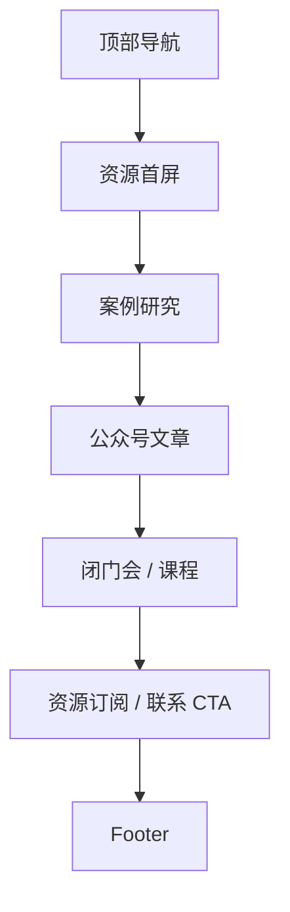

# 03 资源

> 状态：骨架待讨论。资源页负责承接案例、公众号、闭门会和课程内容。

## 1. 页面目标

- 待讨论：资源页首版是否只做内容占位
- 待讨论：案例与洞察的展示比例

## 2. 用户路径

- 企业主看案例：
- 人才看洞察：
- 读者进入公众号/闭门会：

## 3. 页面模块

1. 资源首屏
2. 商业资源中心
3. 案例研究
4. 公众号文章
5. 闭门会
6. 课程 / Program
7. CTA

## 4. 线框图

## 5. 点击跳转

- 查看案例：
- 阅读文章：
- 报名闭门会：
- 了解课程：

## 6. 待补内容

- 首批匿名案例
- 公众号首篇标题
- 闭门会主题
- 课程/Program 口径
