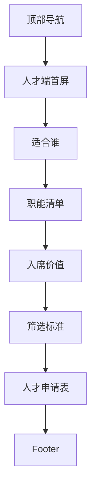

# 04 加入左安

> 状态：骨架待讨论。人才端页面，负责吸引高阶人才申请入席。

## 1. 页面目标

- 待讨论：导航命名是“加入左安”还是“贤才入席”
- 待讨论：第一批人才门槛

## 2. 用户路径

- 高阶人才理解左安：
- 高阶人才判断是否适合：
- 高阶人才提交申请：

## 3. 页面模块

1. 人才端首屏
2. 左安寻找什么样的人
3. 第一批职能清单
4. 入席价值
5. 筛选标准
6. 申请表单
7. 闭门会 / 内容共创入口

## 4. 线框图

## 5. 点击跳转

- 申请入席：
- 查看资源：
- 参与闭门会：

## 6. 表单字段占位

- 姓名
- 当前身份
- 核心职能
- 代表经历
- 擅长解决的问题
- 可投入时间
- 联系方式

## 7. 待补内容

- 人才端价值主张
- 第一批岗位/职能
- 筛选标准
- 邀请文案
