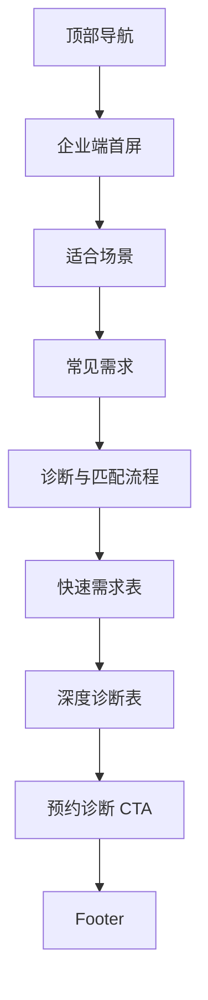

# 05 寻找人才

> 状态：骨架待讨论。企业端转化页，负责承接企业需求和预约诊断。

## 1. 页面目标

- 待讨论：企业端第一表单轻重分级
- 待讨论：是否叫“寻找人才”或“企业求贤”

## 2. 用户路径

- 企业主识别问题：
- 企业主理解左安介入方式：
- 企业主提交需求：

## 3. 页面模块

1. 企业端首屏
2. 适合找左安的场景
3. 常见需求
4. 左安如何判断你需要什么人
5. 企业快速需求表
6. 企业深度诊断表
7. 预约诊断 CTA

## 4. 线框图

## 5. 点击跳转

- 快速提交需求：
- 填写深度诊断：
- 预约沟通：

## 6. 表单字段占位

### 快速需求表

- 姓名
- 公司
- 职位
- 联系方式
- 当前最想解决的问题
- 期望合作方式

### 深度诊断表

- 行业
- 公司阶段 / 规模
- 问题描述
- 已尝试方法
- 时间要求
- 预算情况
- 需要的人才类型

## 7. 待补内容

- 企业痛点原话
- 典型需求企业
- 需求分级规则
- 预约诊断说明
