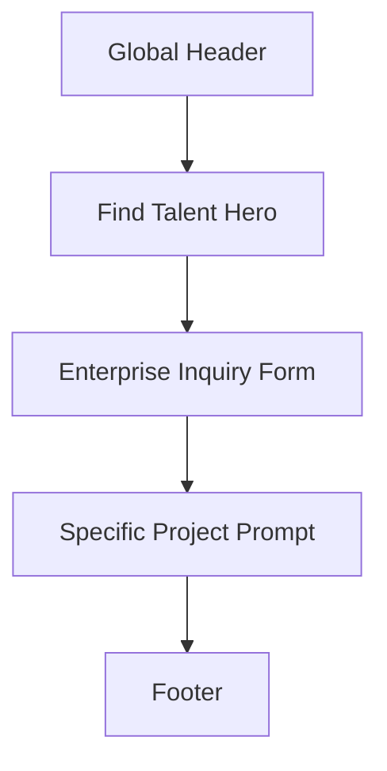

# 05 寻找人才

> 状态：已确认方向。企业端极简需求表单页，参考 BTG `project-inquiry` 的清晰结构，但转译为左安门语境。

## 1. Coding Agent 角色

你是这个项目的资深前端工程协作者，负责把 `docs/find/find-talent.md` 转化为 `/find-talent` 企业需求提交页高保真原型。

本页不是资源中心、不是长篇服务介绍页，也不是复杂诊断工具。它只承担一个核心任务：让企业访客用最少成本提交关键问题，方便左安门判断需求、诊断问题并进入匹配沟通。

## 1.1 参考文件使用方式

| 参考 | 使用方式 |
|---|---|
| `docs/DESIGN.md` | 视觉基准。使用 IBM / Carbon 风格的蓝白企业感、清晰层级、克制留白和专业表单样式。 |
| `docs/home/home.md` | 文档结构和 harness 写法参考。只学习其页面级说明方式，不复制首页模块复杂度。 |
| `https://info.businesstalentgroup.com/project-inquiry/` | 信息组织参考。学习其短标题、短说明、表单优先和替代路径，不复制文案。 |
| `fronted/shared/` | Header / Footer 的统一组件标准参考。只学习现有统一规范，不改 shared 文件。 |
| `fronted/find-talent/` | 本页主体实现位置。页面级 HTML、CSS、JS、本页专属图片占位和本页专属交互都放这里。 |

## 1.2 技术与 Harness 约束

- docs 路径：`docs/find/find-talent.md`
- 页面文件夹：`fronted/find-talent/`
- 建议路由：`/find-talent`
- 本页只实现静态高保真原型，不接真实后端。
- 技术方案固定为 HTML + CSS + JS。
- 表单提交只做前端状态反馈，例如按钮 loading、提交成功提示、必填项校验提示。
- 所有文件修改都只放在 `fronted/find-talent/`。
- 不修改 `fronted/shared/`、`fronted/resources/`、`fronted/services/`、`fronted/home/` 或其他页面。
- Header、Footer 参考 `fronted/shared/` 的统一组件标准，只在本页内静态还原，不要修改 shared 文件。

## 2. 页面定位

`/find-talent` 是左安门官网的企业需求入口。

页面职责：

- 收集企业基础信息。
- 收集当前最关键的问题或任务。
- 帮助左安门判断后续是进入人才匹配、预约沟通，还是进一步补充项目细节。

页面不承担：

- 不展示完整服务体系。
- 不做复杂资源推荐。
- 不做多步骤问卷。
- 不教育用户阅读大量内容后再提交。

一句话目标：

让企业访客快速说清楚“我是谁、我遇到什么问题、希望左安门帮我判断什么”。

## 3. 用户路径

### 企业主路径

1. 从首页、服务页或 header CTA 进入 `/find-talent`。
2. 看到简短标题和说明，确认这是提交企业需求的入口。
3. 填写企业信息、联系方式和关键问题。
4. 如已有明确项目，可以通过辅助入口补充更详细任务信息或预约沟通。
5. 提交后看到明确反馈，知道左安门下一步会如何跟进。

### 明确项目路径

1. 用户已经有项目 brief、岗位需求或阶段性任务。
2. 在表单旁看到“已有明确任务？”辅助提示。
3. 选择补充项目细节或预约沟通。

## 4. 页面信息架构

页面采用 BTG 式极简结构：短首屏 + 主表单 + 一条辅助路径。

1. Global Header
2. Find Talent Hero
3. Enterprise Inquiry Form
4. Specific Project Prompt
5. Footer

不新增问题卡片区、案例区、资源区、流程长条或复杂筛选器。

## 5. 高保真布局说明

### 5.1 Global Header Component

目标：

- 保持官网导航一致性。
- 让企业访客明确自己处在“寻找人才 / 提交企业需求”入口。
- 参考 `fronted/shared/` 的统一头部规范，保持站内一致。

内容：

- 左安门品牌标识。
- 主导航：服务、案例、资源、加入左安门。
- 主 CTA：寻找人才，当前页高亮。

布局：

- 白底、细分隔线、Carbon 风格蓝色 CTA。
- 桌面端横向导航。
- 移动端可简化为品牌 + CTA + 菜单图标的静态还原。

### 5.2 Find Talent Hero Component

目标：

- 用极少文字说明页面用途。
- 避免营销式大段介绍。

建议内容结构：

- Eyebrow：企业需求入口
- H1：提交你的关键问题
- Supporting copy：用两三句话说明左安门会根据企业阶段、问题类型和任务边界，判断适合的高阶人才匹配方式。

视觉：

- 左侧为标题和短说明。
- 右侧或下方直接进入表单。
- 不使用大图、不使用复杂插画、不使用渐变装饰。

### 5.3 Enterprise Inquiry Form Component

目标：

- 表单是页面主角。
- 字段足够让左安门初步判断，但不能让用户感觉是在填写长问卷。

建议字段：

| 字段 | 类型 | 要求 |
|---|---|---|
| 姓名 | text | 必填 |
| 公司 | text | 必填 |
| 职位 | text | 选填 |
| 联系方式 | email / phone | 必填 |
| 企业阶段 / 规模 | select | 选填 |
| 当前最想解决的问题 | textarea | 必填 |
| 希望左安门帮助判断什么 | textarea | 选填 |
| 时间要求 | select | 选填 |

表单交互：

- 必填项为空时显示简短 inline error。
- 提交按钮文字使用“提交企业需求”。
- 提交成功后在表单区域显示成功状态，不跳转。
- 成功状态说明：已收到需求，左安门会基于问题背景判断后续沟通方式。

### 5.4 Specific Project Prompt Component

目标：

- 对应 BTG 页面里的 “Have a specific project in mind?” 辅助路径。
- 不做成第二个大模块，只作为表单旁边或表单下方的一条轻提示。

建议内容：

- 标题：已经有明确任务？
- 说明：如果你已经有项目 brief、岗位需求或阶段性目标，可以在问题描述中直接粘贴要点。
- 次级链接：预约沟通 或 查看服务方式。

点击建议：

- `预约沟通` 可以先锚定到同页表单或保持占位链接。
- `查看服务方式` -> `/services/on-demand-talent`
- 如未来有详细项目表单，再扩展到独立路由。

### 5.5 Footer Component

目标：

- 提供基础站点收束。
- 不新增资源推广内容。
- 参考 `fronted/shared/` 的统一底部规范，保持站内一致。

内容：

- 品牌说明。
- 服务入口。
- 案例入口。
- 企业需求入口。
- 人才加入入口。

## 6. 点击跳转

- Header `寻找人才` -> `/find-talent`
- 首页企业 CTA -> `/find-talent`
- 服务页主 CTA -> `/find-talent`
- `/find-talent` 表单提交 -> 同页成功状态
- `查看服务方式` -> `/services/on-demand-talent`
- `案例研究` -> `/resources/case-studies`
- `加入左安门` -> `/join`

## 7. 视觉与组件要求

- 采用 `docs/DESIGN.md` 的 IBM / Carbon 蓝白企业风格。
- 页面背景以白色和极浅灰为主。
- 主按钮使用清晰蓝色，不使用大面积渐变。
- 表单字段要有明确 label、输入边界、focus 状态和错误提示。
- 布局应像企业级 B2B 表单页：安静、可信、直接。
- 不使用营销页式大 hero、不使用卡片堆叠、不使用资源瀑布流。
- 桌面端优先使用左右分栏：左侧短说明，右侧表单。
- 移动端改为纵向：说明在上，表单在下。

## 8. 文案语气

文案要短、准、克制。

应使用：

- “提交企业需求”
- “关键问题”
- “企业阶段”
- “任务边界”
- “后续沟通”
- “匹配方式”

避免使用：

- “开启转型之旅”
- “赋能企业未来”
- “一站式解决方案”
- “海量人才资源”
- “立即解锁”

## 9. 线框图



桌面布局：

```text
┌────────────────────────────────────────────┐
│ Header                                     │
├───────────────────┬────────────────────────┤
│ 企业需求入口       │ 企业需求表单             │
│ H1 + 2-3 行说明    │ 姓名 / 公司 / 联系方式    │
│                   │ 当前关键问题             │
│ 已有明确任务？     │ 提交企业需求             │
├───────────────────┴────────────────────────┤
│ Footer                                     │
└────────────────────────────────────────────┘
```

移动布局：

```text
┌────────────────────┐
│ Header             │
├────────────────────┤
│ Hero               │
├────────────────────┤
│ Form               │
├────────────────────┤
│ Specific Project   │
├────────────────────┤
│ Footer             │
└────────────────────┘
```

## 10. 完成标准

- 页面只围绕企业需求提交，不扩展为资源页或复杂诊断页。
- 首屏能立即看懂：这里是提交企业需求的入口。
- 表单字段完整但不冗长。
- 有提交成功状态和必填项错误状态。
- 视觉符合 `docs/DESIGN.md` 的蓝白企业风格。
- 所有实现文件只放在 `fronted/find-talent/`。
- 不修改其他页面、shared 文件或资源页。
