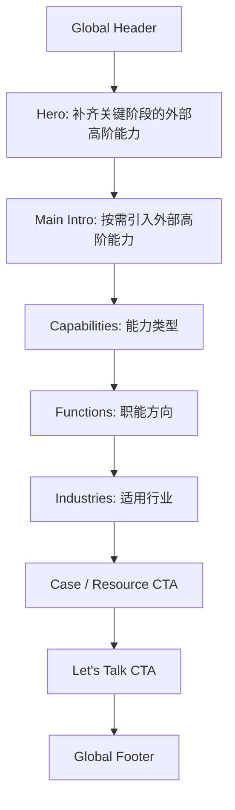

# 02 我们做什么 / 按需人才

> 状态：待定稿。此页同时承担左安门 services 总览页与“按需人才 / On-demand Talent”主说明页职责。
> 参考编排：BTG Services 页。保留其简洁清晰的页面骨架，替换为左安门语境、命名和可信度表达。

## 1. Coding Agent 角色

你是这个项目的资深前端工程协作者，负责把本页文档转化为 `/services` 高保真原型。

开发时必须先读：

- `PROJECT_PROGRESS.md`：看当前阶段、页面路由和项目总体边界。
- `docs/DESIGN.md`：看 IBM/Carbon 蓝白企业风格、颜色、字体和组件规则。
- `docs/home/home.md`：看首页已经定稿的写法、页面粒度和 harness 还原方式。
- `docs/services/on-demand-talent/on-demand-talent.md`：看本页的最终页面职责、模块顺序、跳转和完成标准。
- `fronted/shared/`：看全站共享导航栏、footer、Header CTA、移动端展开逻辑和共享样式边界。
- `fronted/shared/shared.js`：看统一导航栏、footer、header CTA 和共享路由逻辑。
- `fronted/shared/shared.css`：看统一导航栏、footer、移动端展开状态和全站共享样式约束。

设计判断：

- 参考 BTG Services 页的信息编排，不重新发明页面结构。
- 保持 IBM/Carbon 蓝白企业风格。
- 页面要简洁、清楚、可扫读。
- 不照搬 BTG 文案、数字、客户背书和海外案例。
- 不把页面做成招聘页、平台页、营销长文或表单页。

## 2. 技术与 Harness 约束

- 技术框架：HTML + CSS。
- 交互实现：JavaScript。
- 页面路由：`/services`
- 页面文件夹：`fronted/resources/on-demand-talent/`
- Header 点击 `我们做什么` -> `/services`
- 服务卡片点击 `按需人才` -> `/services`
- `临时高管` -> `/services/interim-executive`
- `提交需求` / `提交企业需求` -> `/find-talent`
- `查看案例研究` -> `/resources/case-studies`
- 不接入真实后端。
- 不创建登录、后台、支付、人才匹配引擎。
- 只允许在 `fronted/resources/on-demand-talent/` 工作区内实现本页。
- 不修改 `fronted/join/`、`fronted/find-talent/`、`fronted/resources/case-studies/`、`fronted/resources/talent-resources/`、`fronted/resources/article-pages/`。
- 如需使用 Header/Footer，必须复用 `fronted/shared/` 里的统一导航栏与 footer 逻辑，不要在本页重复造全站导航或页脚。

## 3. 页面定位

此页不是纯目录页，而是“services 总览 + 按需人才主说明页”。

它需要在一个页面里完成两件事：

1. 总览左安门能为企业补齐哪些外部高阶能力。
2. 重点解释“按需人才”这种服务模式是什么、适合什么问题、左安门如何介入。

核心表达：

> 企业在关键阶段不一定先需要新增长期岗位，而可能需要按需引入外部高阶能力，补齐判断、经验、推进和阶段性交付。

## 4. 用户路径

### 企业主路径

1. 从 Header 点击 `我们做什么`。
2. 进入 `/services`。
3. 快速理解左安门提供按需人才、临时高管、项目制专家等外部能力。
4. 浏览能力、职能、行业三组分类。
5. 点击 `提交企业需求` 进入 `/find-talent`。

### 企业问题校准路径

1. 用户不确定自己需要什么角色。
2. 通过 Capabilities / Functions / Industries 三组分类识别问题归属。
3. 点击相关卡片或 CTA。
4. 进入 `/find-talent`，由需求页进一步承接问题诊断。

### 服务深化路径

1. 用户看到 `临时高管`。
2. 点击进入 `/services/interim-executive`。
3. 查看更具体的临时高管服务说明。

## 5. 页面信息架构

本页直接借鉴 BTG Services 页的编排节奏：

1. Global Header
2. Hero
3. Main Intro / On-demand Talent Explanation
4. Capabilities
5. Functions
6. Industries
7. Case / Resource CTA
8. Let's Talk CTA
9. Global Footer

不要新增复杂的长篇叙事区。必要说明应嵌入这些模块里。

## 6. 高保真布局说明

### 6.1 Global Header Component

复用全站 Header。

导航状态：

- `我们做什么` 为当前激活项。
- Header 主 CTA `提交需求` 指向 `/find-talent`。
- Header 次 CTA `申请入席` 指向 `/join`。

### 6.2 Hero Component

参考 BTG 的简洁 hero：大标题、一句话说明、主 CTA。

建议文案方向：

- Title：`补齐关键阶段的外部高阶能力`
- Subtitle：`按问题、职能和阶段，引入按需人才、临时高管与专家支持，帮助企业在关键节点获得判断、经验和推进能力。`
- Primary CTA：`提交企业需求` -> `/find-talent`
- Secondary CTA：`查看案例研究` -> `/resources/case-studies`

视觉：

- 白底或浅灰 section。
- 左侧标题和文案，右侧可以放结构化能力面板。
- 不使用大图堆叠，不使用装饰性渐变。

### 6.3 Main Intro / On-demand Talent Explanation

对应 BTG 的 `LIMITLESS ACCESS TO TALENT AND SKILLS` 主说明区。

左安门转译：

- 标题：`按需引入外部高阶能力`
- 内容说明“按需人才”不是传统招聘，也不是简单外包，而是在企业阶段性问题上补齐外部经验、判断和推进能力。
- 用 3 个短点解释：
  - 先判断问题，再判断需要什么人。
  - 按阶段引入，不必先创建长期岗位。
  - 可从诊断、方案、推进到阶段性交付。

布局：

- 左侧小标题，右侧说明段落。
- 下方可放 3 个横向信息块。

### 6.4 Capabilities Section

对应 BTG 的 `CAPABILITIES`。

标题：

- `能力类型`

说明：

- `左安门围绕企业关键阶段问题，组织外部高阶人才提供诊断、方案和推进支持。`

卡片建议：

1. `战略与增长`
   - 市场判断、增长模型、渠道与商业化问题。
   - Link：`/find-talent`
2. `临时高管`
   - 阶段性管理职责、关键岗位过渡、组织稳定。
   - Link：`/services/interim-executive`
3. `运营与组织`
   - 流程、供应链、团队协作、组织机制优化。
   - Link：`/find-talent`
4. `AI 与数字化转型`
   - 识别可落地场景，设计试点路径。
   - Link：`/find-talent`
5. `项目推进`
   - 关键项目负责人、PMO、跨职能推进。
   - Link：`/find-talent`
6. `专家诊断`
   - 在决策前获得行业、职能或管理经验判断。
   - Link：`/find-talent`

视觉：

- 图标 + 标题 + 一句话说明。
- 2 或 3 列 grid。
- 卡片方正、细边框、轻 hover。

### 6.5 Functions Section

对应 BTG 的 `FUNCTIONS`。

标题：

- `职能方向`

卡片建议：

1. `增长与市场`
2. `财务与经营`
3. `组织与人才`
4. `运营与供应链`
5. `战略与新业务`
6. `技术与 AI`

每张卡只需要一句话，不要写成服务承诺。

视觉：

- 可以比 Capabilities 更轻，像 compact list grid。
- 保持可扫读，不要过度解释。

### 6.6 Industries Section

对应 BTG 的 `INDUSTRIES`。

标题：

- `适用行业`

卡片建议：

1. `消费与零售`
2. `金融与投资`
3. `医疗健康`
4. `先进制造`
5. `企业服务`
6. `科技与互联网`
7. `教育与内容`

说明：

- 只表达“可覆盖的讨论方向”，不要暗示已有大量行业客户。

视觉：

- 使用轻量图标或行业标签卡。
- 信息密度低于 BTG，避免堆满页面。

### 6.7 Case / Resource CTA

对应 BTG 的 report CTA。

左安门不使用报告下载，因为当前没有已确认报告资产。

替代为：

- 标题：`从真实企业问题中理解外部能力如何介入`
- 文案：`查看左安门正在整理的匿名案例样本，了解不同阶段问题如何被拆解、匹配和推进。`
- CTA：`查看案例研究` -> `/resources/case-studies`

视觉：

- 全宽浅灰 band。
- 左侧文案，右侧放 2-3 个小型匿名案例标签。

### 6.8 Let's Talk CTA

对应 BTG 的 `Let's Talk`。

标题：

- `让左安门先帮你判断需要什么人`

说明：

- `提交一个简短需求，我们会先理解企业当前问题，再判断适合引入哪类外部能力。`

CTA：

- Primary：`提交企业需求` -> `/find-talent`
- Secondary：`查看临时高管` -> `/services/interim-executive`

视觉：

- 深色或白底强分隔 CTA band 均可。
- 不内嵌完整表单。

### 6.9 Global Footer Component

复用全站 Footer。

Footer 链接建议：

- `按需人才` -> `/services`
- `临时高管` -> `/services/interim-executive`
- `案例研究` -> `/resources/case-studies`
- `成为独立人才` -> `/join`

## 7. 点击跳转

Header：

- `首页` -> `/`
- `我们做什么` -> `/services`
- `资源` -> `/resources/case-studies`
- `加入左安` -> `/join`
- `寻找人才` -> `/find-talent`

页面内：

- `按需人才` -> `/services`
- `临时高管` -> `/services/interim-executive`
- `提交企业需求` -> `/find-talent`
- `查看案例研究` -> `/resources/case-studies`

## 8. 交互要求

本页只需要轻量交互：

- 卡片 hover / focus-visible 状态。
- 点击卡片跳转。
- 移动端 grid 自动变为单列或两列。
- 不做筛选、搜索、复杂 tabs。
- 不做真实表单提交。

## 9. 文案语气

应该：

- 克制、清楚、企业级。
- 强调问题判断、外部能力、阶段性支持。
- 保持“我们可以帮助你判断”的语气。

避免：

- “顶级人才库”“海量专家”“最快当天匹配”等未经确认承诺。
- 直接照搬 BTG 的数据和海外背书。
- 把按需人才讲成猎头招聘。
- 把页面讲成平台功能介绍。

## 10. 线框图

## 11. 完成标准

页面完成后应满足：

- 5 秒内能理解左安门“我们做什么”。
- 明确 `/services` 同时是 services 总览页和按需人才主说明页。
- 页面结构直接借鉴 BTG Services 的简洁编排。
- 能清楚区分按需人才与临时高管。
- 所有 CTA 跳转清晰。
- 没有虚构客户、数字、案例或交付承诺。
- 桌面和移动端都具备企业级高保真观感。
